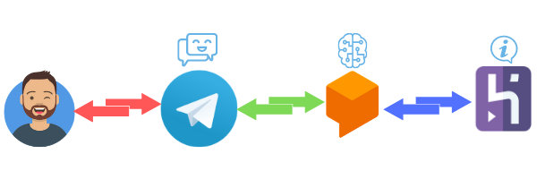
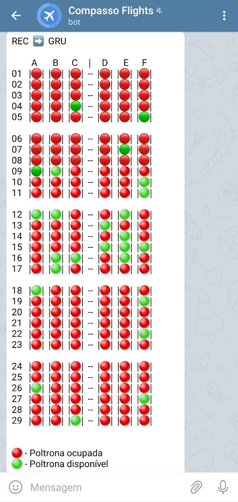
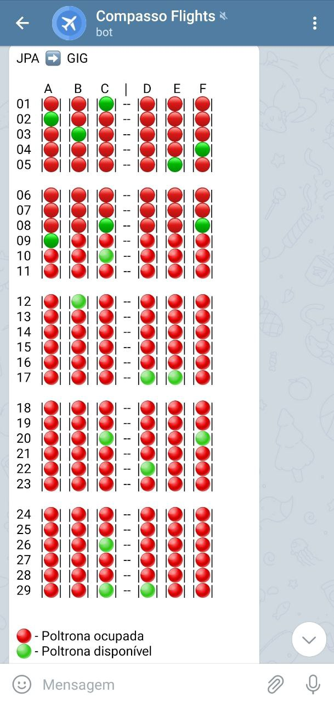
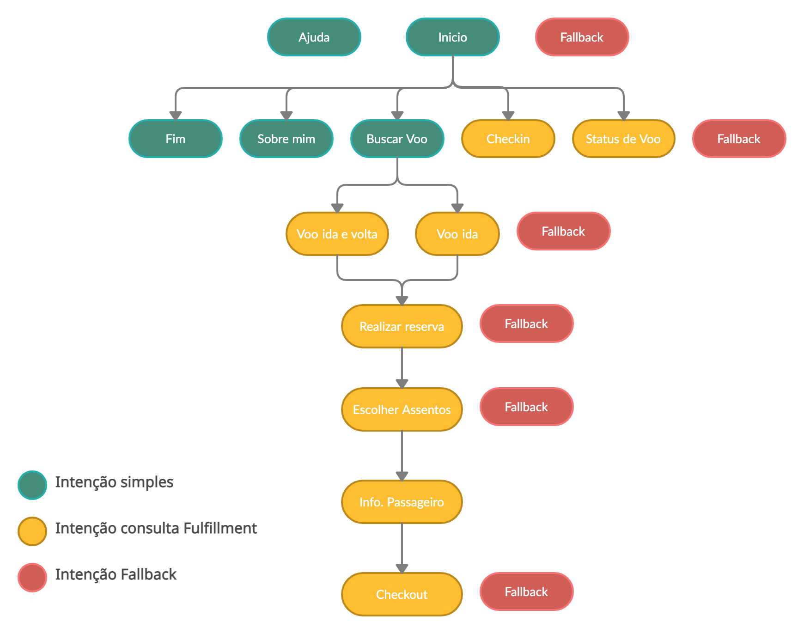

    <h2 align='center'>Compasso Flights</h2>
    
Seu assistente de voos ✈️

### Overview

<a href='https://t.me/CompassoFlights_bot'>Compasso Flights</a> (@CompassoFlights_bot) é um 🤖 (bot) que te auxilia na busca de passagens aéreas, a fazer reserva de passagem, realizar check-in de voo e verificar o status do voo. 

### Architecture Diagram

A arquitetura do bot é bastante simples. O agente mais a esquerda é o usuário final, aquele que irá fazer uso das funcionalidades oferecidas pelo <a href='https://t.me/CompassoFlights_bot'>Compasso Flights  ✈️</a>
 
O segundo agente é o Telegram, canal onde o bot foi publicado e poderá ser consumido pelo usuário final. Ele possui uma integração direta com o DialogFlow, e isso facilitou muito o desenvolvimento dessa arquitetura.
 
O terceiro agente é o DialogFlow, uma importante ferramenta de NLP desenvolvida pela Google. É nela onde acontece todo o controle conversacional entre humano e máquina, tornando possível que a máquina entenda as intenções humanas e execute uma ação.
 
O último agente é um webhook desenvolvido em NodeJS hospedado na plataforma Heroku, ele é quem possibilita a comunicação do DialogFlow com a API de dados de voos e faz todas as tratativas necessárias para realizar as ações solicitadas pelo usuário.

### ToDo
- [x] <b>Integrar bot no Telegram com o DialogFlow</b>
- [x] <b>Criar intenções básicas</b> <i>(Welcome, About me)</i>
- [x] <b>Intenção Status de Voo</b>
- [x] <b>Intenção Check-in</b>
- [X] <b>Intenção de Consulta de voos</b> 
- [x] <b>Intenção de Reserva de voo</b> 
    <b>Problema:</b><i>como buscar por aeroportos pelo nome da cidade?</i> 
    <blockquote>Utilizando uma lista feita a mão de todos os aeroportos do Brasil com nome da cidade e código IATA.
    </blockquote> 
    <b>Problema:</b> <i>como mostrar as vagas disponíveis no voo de forma intuitiva? </i>
    
 
        
        
    
 
    <blockquote> Esse foi um dos grandes problemas desse projeto, os usuários não tinham uma boa noção das poltronas vazias da aeronave para que pudessem realizar sua escolha no momento da reserva. Utilizando essa abordagem é possível oferecer ao cliente uma minima visualização dos assentos livres e ocupados, para que ele escolha os mais adequados.</blockquote>
     
    <b>Problema:</b> <i>como receber os dados de mais de um passageiro?</i>  
    <blockquote>Criando uma intenção recorrente que solicita as informações necessárias para a reserva de cada uma das pessoas de acordo com a quantidade de passageiros informadas durante a reserva.</blockquote>
- [ ] <b>Check-out</b> 
    A intenção de Check-Out ainda precisa ser melhorada, no momento apenas é perguntado qual será o método de pagamento e não é feito nenhum tipo de tratativa com relação a isso. As próximas <i>features</i> trarão um check-out mais aprimorado que irá gerar boleto para pagamento ou página especifica para finalização do pagamento com cartão de crédito ou débito.

### Intents Diagram

### Development and Tests
Durante o processo de desenvolvimento, foi utilizado o Ngrok para criar um tunel entre a rede local e a internet para que o DialogFlow tivesse acesso ao webhook durante o processo de desenvolvimento. Dessa forma o debug e feedback aconteceram de forma mais rápida. 

Os testes de cada funcionalidade foram realizados manualmente, dentro do aplicativo Telegram. Dessa maneira pude ter uma ideia melhor da experiência de usuário. 

### Technologies
- <a href='https://dialogflow.cloud.google.com/'>
    DialogFlow</img>
</a>

- <a href='https://nodejs.org/'>
    NodeJS</img>
</a>

- <a href='https://t.me/CompassoFlights_bot'>
    Telegram</img>
</a>

- <a href='https://t.me/CompassoFlights_bot'>
    Heroku</img>
</a>
